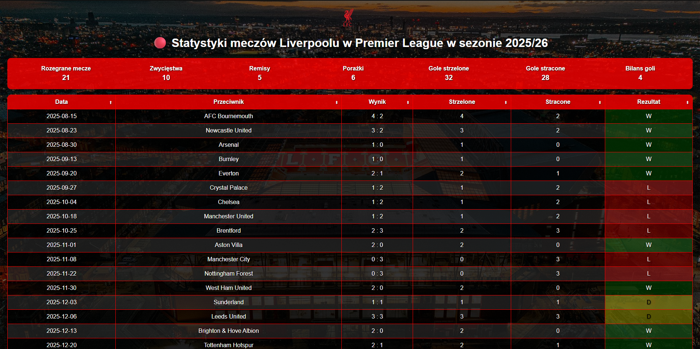

# Strona Liverpool 2025/26

🔴 **Projekt portfolio** – interaktywna strona prezentująca mecze Liverpoolu w sezonie 2025/26 w Premier League.

---

## 🔹 Opis projektu

Strona pokazuje wszystkie rozegrane mecze Liverpoolu w sezonie 2025/26:

- Tabela z datą, przeciwnikiem, wynikiem i statystykami goli  
- Panel statystyk: liczba zwycięstw, remisów, porażek i bilans goli  
- Możliwość sortowania tabeli po nagłówkach i filtrowania wyników (Zwycięstwo / Remis / Porażka)  
- Kolorowanie wyników dla lepszej czytelności  
- Interaktywne efekty hover w panelu statystyk  

Projekt pokazuje **umiejętności w HTML, CSS i JavaScript** oraz wykorzystanie **Git/GitHub Pages** do hostingu strony.

---

## 🔹 Technologie

- HTML5  
- CSS3  
- JavaScript (vanilla)  
- Git / GitHub Pages  

---

## 🔹 Screenshot



> Teraz screenshot pokazuje najnowszą wersję strony.  

---

## 🔹 Live Demo

Strona jest dostępna online:  
[https://bestsellerr.github.io/Strona-Liverpool/](https://bestsellerr.github.io/Strona-Liverpool/)

---

## 🔹 Kontakt i portfolio

- **GitHub:** [https://github.com/bestsellerr](https://github.com/bestsellerr)  
- **E-mail:** bestsellerr@example.com  

---

## 🔹 Jak uruchomić lokalnie

1. Sklonuj repo:

```bash
git clone https://github.com/bestsellerr/Strona-Liverpool.git
```
2.Otwórz index.html w przeglądarce lub uruchom Live Server w VSCode.

3.Gotowe – strona działa lokalnie.
